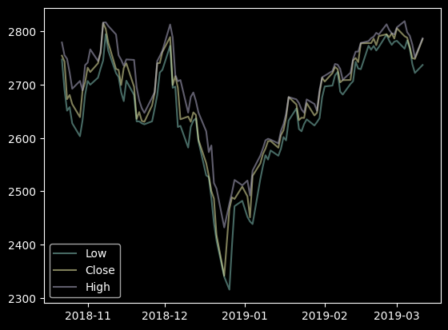
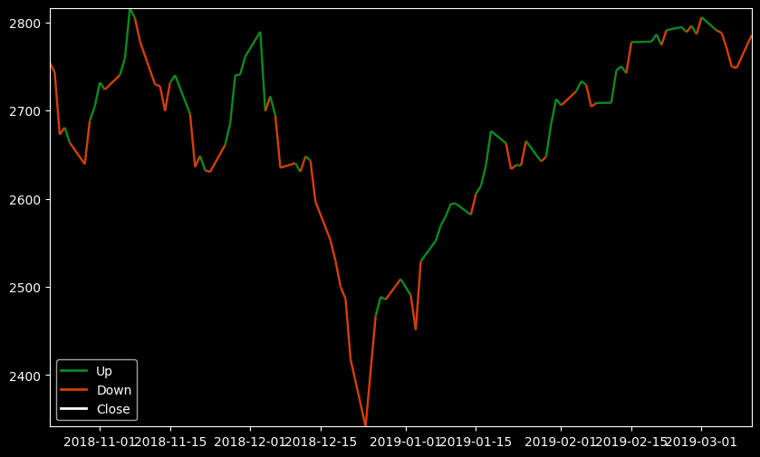
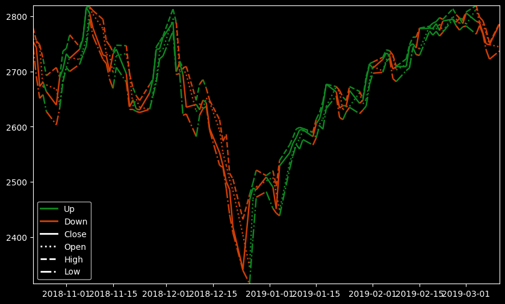
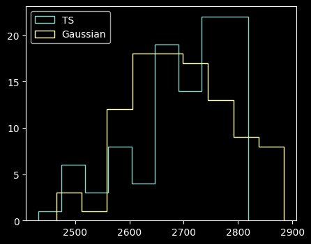
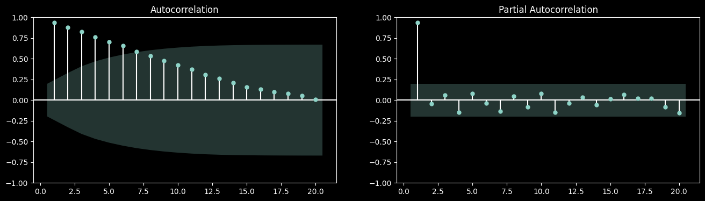
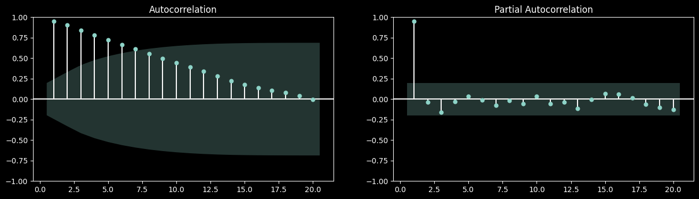
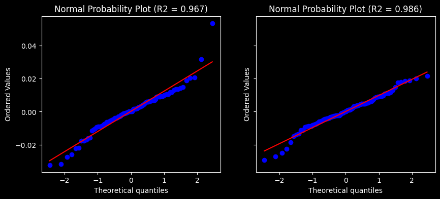

# plotting


<!-- WARNING: THIS FILE WAS AUTOGENERATED! DO NOT EDIT! -->

------------------------------------------------------------------------

<a
href="https://github.com/vtecftwy/myquantlab/blob/main/myquantlab/plotting.py#L28"
target="_blank" style="float:right; font-size:smaller">source</a>

### plot_timeseries

``` python

def plot_timeseries(
    tseries:Series, # one of several np.Series with DataTimeIndex
    ax:Optional=None, # axis to plot
    add_legend:bool=False, # add legend to plot, when True
)->None:

```

``` python
df = load_test_df()
plot_timeseries(df.Low, df.Close, df.High, add_legend=True)
```



------------------------------------------------------------------------

<a
href="https://github.com/vtecftwy/myquantlab/blob/main/myquantlab/plotting.py#L46"
target="_blank" style="float:right; font-size:smaller">source</a>

### plot_two_color_line

``` python

def plot_two_color_line(
    s:Series, # Data to plot as a pd.Series with DateTimeIndex
    cond:pandas.Series | numpy.ndarray, # boolean condition defining the colors to apply (same length as s)
    cond_labels:tuple=('Up', 'Down'), # labels for the condition to be used in the legend
    ax:matplotlib.axes._axes.Axes | None=None, # ax where to plot; if None, a new figure and ax will be created and shown
    linestyle:str='-', # '-' or 'solid'; '--' or 'dashed'; ':' or 'dotted'; '-.' or 'dashdot'
    figsize:tuple=(10, 6), colors:tuple=('#0D8821', '#D13F05')
):

```

``` python
df = load_test_df()
df['R'] = df.Close.pct_change()

cond = df['R'] > 0
plot_two_color_line(df['Close'], cond)
```



It is also possible to add a conditional line to an existing axes

``` python
df = load_test_df()
df['R'] = df.Close.pct_change()
cond = df['R'] > 0

fig, ax = plt.subplots(figsize=(10, 6))
plot_two_color_line(df['Close'], cond, ax=ax)
plot_two_color_line(df['Open'], cond, ax=ax, linestyle=':')
plot_two_color_line(df['High'], cond, ax=ax, linestyle='--')
plot_two_color_line(df['Low'], cond, ax=ax, linestyle='-.')
plt.show()
```



------------------------------------------------------------------------

<a
href="https://github.com/vtecftwy/myquantlab/blob/main/myquantlab/plotting.py#L117"
target="_blank" style="float:right; font-size:smaller">source</a>

### hist_timeseries

``` python

def hist_timeseries(
    tseries:Series, ax:Optional=None
)->None:

```

``` python
hist_timeseries(df.High)
```



------------------------------------------------------------------------

<a
href="https://github.com/vtecftwy/myquantlab/blob/main/myquantlab/plotting.py#L144"
target="_blank" style="float:right; font-size:smaller">source</a>

### plot_acfs

``` python

def plot_acfs(
    tseries:VAR_POSITIONAL, incl_lag0:bool=False, alpha:float=0.05, ax:NoneType=None
):

```

``` python
plot_acfs(df.Close, df.High)
```





------------------------------------------------------------------------

<a
href="https://github.com/vtecftwy/myquantlab/blob/main/myquantlab/plotting.py#L155"
target="_blank" style="float:right; font-size:smaller">source</a>

### normal_probability_plot

``` python

def normal_probability_plot(
    tseries:VAR_POSITIONAL, ax:NoneType=None
):

```

``` python
normal_probability_plot(df.Close.pct_change().dropna(), df.High.pct_change().dropna())
```


