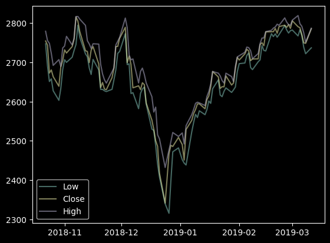
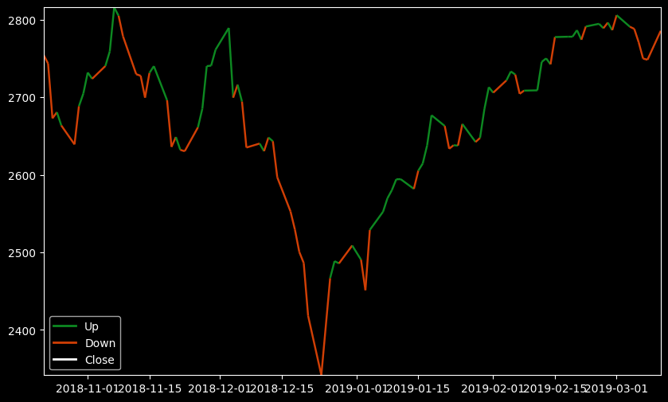
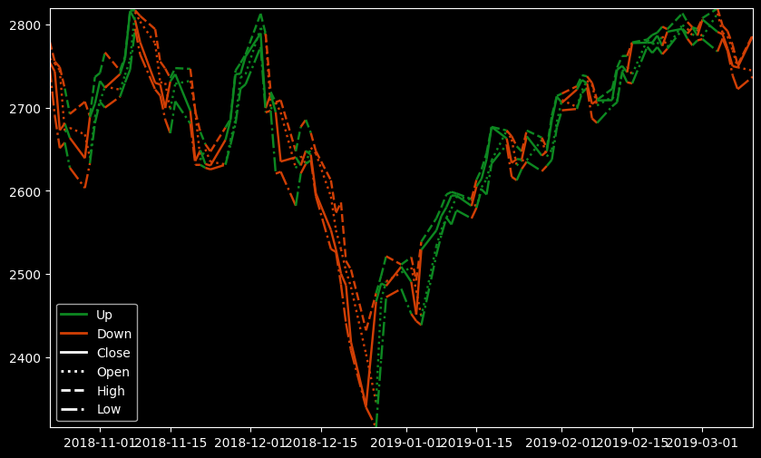
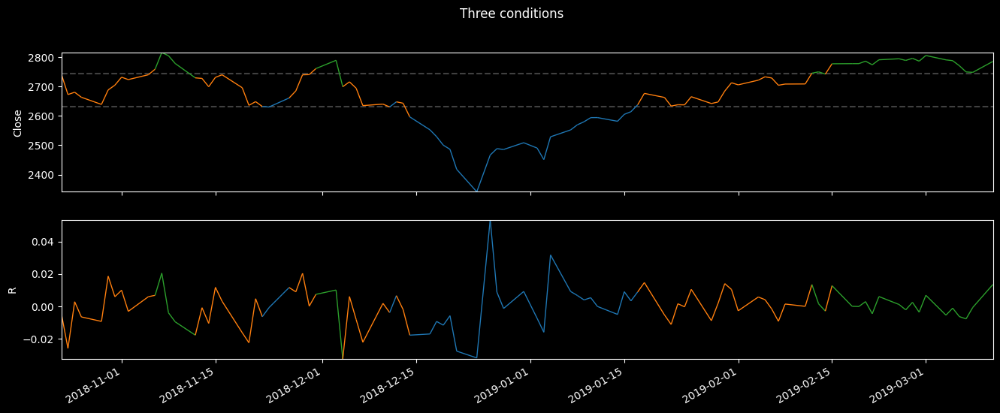
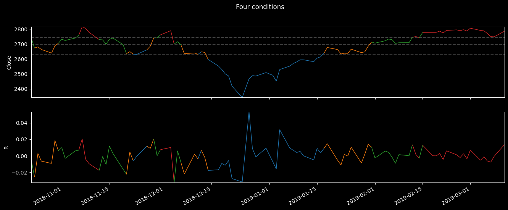
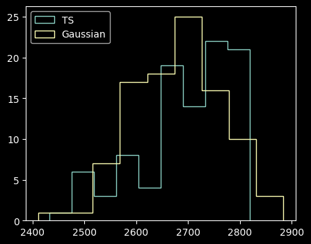
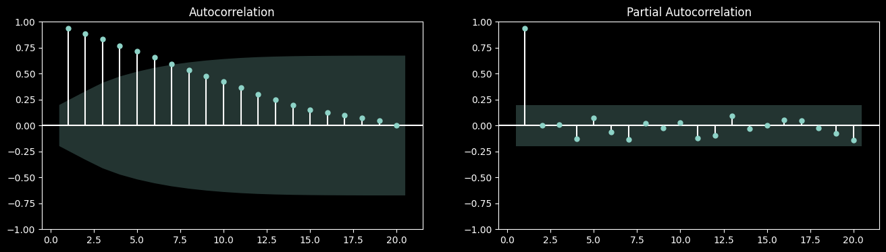
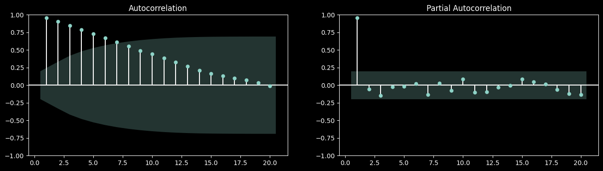
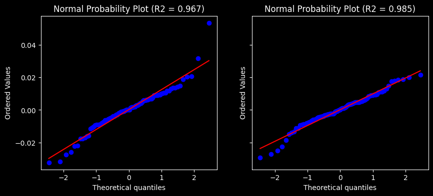

# plotting


<!-- WARNING: THIS FILE WAS AUTOGENERATED! DO NOT EDIT! -->

------------------------------------------------------------------------

<a
href="https://github.com/vtecftwy/myquantlab/blob/main/myquantlab/plotting.py#L31"
target="_blank" style="float:right; font-size:smaller">source</a>

### plot_timeseries

``` python
def plot_timeseries(
    *tseries:Series, # one of several np.Series with DataTimeIndex
    ax:Optional=None, # axis to plot
    add_legend:bool=False, # add legend to plot, when True
)->None:
```

*Call self as a function.*

``` python
df = load_test_df()
plot_timeseries(df.Low, df.Close, df.High, add_legend=True)
```



------------------------------------------------------------------------

<a
href="https://github.com/vtecftwy/myquantlab/blob/main/myquantlab/plotting.py#L49"
target="_blank" style="float:right; font-size:smaller">source</a>

### plot_two_color_line

``` python
def plot_two_color_line(
    s:Series, # Data to plot as a pd.Series with DateTimeIndex
    cond:pandas.Series | numpy.ndarray, # boolean condition defining the colors to apply (same length as s)
    cond_labels:tuple=('Up', 'Down'), # labels for the condition to be used in the legend
    ax:matplotlib.axes._axes.Axes | None=None, # ax where to plot; if None, a new figure and ax will be created and shown
    linestyle:str='-', # '-' or 'solid'; '--' or 'dashed'; ':' or 'dotted'; '-.' or 'dashdot'
    figsize:tuple=(10, 6), colors:tuple=('#0D8821', '#D13F05')
):
```

*Call self as a function.*

``` python
df = load_test_df()
df['R'] = df.Close.pct_change()

cond = df['R'] > 0
plot_two_color_line(df['Close'], cond)
```



It is also possible to add a conditional line to an existing axes

``` python
df = load_test_df()
df['R'] = df.Close.pct_change()
cond = df['R'] > 0

fig, ax = plt.subplots(figsize=(10, 6))
plot_two_color_line(df['Close'], cond, ax=ax)
plot_two_color_line(df['Open'], cond, ax=ax, linestyle=':')
plot_two_color_line(df['High'], cond, ax=ax, linestyle='--')
plot_two_color_line(df['Low'], cond, ax=ax, linestyle='-.')
plt.show()
```



------------------------------------------------------------------------

<a
href="https://github.com/vtecftwy/myquantlab/blob/main/myquantlab/plotting.py#L120"
target="_blank" style="float:right; font-size:smaller">source</a>

### plot_multi_color_line

``` python
def plot_multi_color_line(
    ax:Axes, # Axes where to plot
    s:Series, # Pandas Series to plot
    cond_list:list, # List of boolean mask (True or False for each rowm in s)
):
```

*Call self as a function.*

We can color the line according to any mutually excluding condition
passed in the cond_list (list of boolean masks)

``` python
df = load_test_df()
df['R'] = df.Close.pct_change()
df = df.dropna()
display(df.describe())
```

<div>
<style scoped>
    .dataframe tbody tr th:only-of-type {
        vertical-align: middle;
    }
&#10;    .dataframe tbody tr th {
        vertical-align: top;
    }
&#10;    .dataframe thead th {
        text-align: right;
    }
</style>

<table class="dataframe" data-quarto-postprocess="true" data-border="1">
<thead>
<tr style="text-align: right;">
<th data-quarto-table-cell-role="th"></th>
<th data-quarto-table-cell-role="th">Open</th>
<th data-quarto-table-cell-role="th">High</th>
<th data-quarto-table-cell-role="th">Low</th>
<th data-quarto-table-cell-role="th">Close</th>
<th data-quarto-table-cell-role="th">Volume</th>
<th data-quarto-table-cell-role="th">R</th>
</tr>
</thead>
<tbody>
<tr>
<td data-quarto-table-cell-role="th">count</td>
<td>98.000000</td>
<td>98.000000</td>
<td>98.000000</td>
<td>98.000000</td>
<td>98.000000</td>
<td>98.000000</td>
</tr>
<tr>
<td data-quarto-table-cell-role="th">mean</td>
<td>2672.851633</td>
<td>2695.045714</td>
<td>2648.687041</td>
<td>2673.703061</td>
<td>26533.061224</td>
<td>0.000191</td>
</tr>
<tr>
<td data-quarto-table-cell-role="th">std</td>
<td>99.568815</td>
<td>92.390865</td>
<td>105.585380</td>
<td>99.665406</td>
<td>14201.804964</td>
<td>0.012402</td>
</tr>
<tr>
<td data-quarto-table-cell-role="th">min</td>
<td>2345.730000</td>
<td>2432.140000</td>
<td>2315.480000</td>
<td>2341.530000</td>
<td>7104.000000</td>
<td>-0.032240</td>
</tr>
<tr>
<td data-quarto-table-cell-role="th">25%</td>
<td>2631.902500</td>
<td>2647.597500</td>
<td>2605.647500</td>
<td>2632.462500</td>
<td>16089.750000</td>
<td>-0.006064</td>
</tr>
<tr>
<td data-quarto-table-cell-role="th">50%</td>
<td>2694.520000</td>
<td>2715.430000</td>
<td>2663.535000</td>
<td>2695.205000</td>
<td>21515.500000</td>
<td>0.000142</td>
</tr>
<tr>
<td data-quarto-table-cell-role="th">75%</td>
<td>2744.212500</td>
<td>2762.150000</td>
<td>2723.555000</td>
<td>2745.025000</td>
<td>34185.500000</td>
<td>0.006873</td>
</tr>
<tr>
<td data-quarto-table-cell-role="th">max</td>
<td>2814.760000</td>
<td>2819.210000</td>
<td>2794.680000</td>
<td>2815.880000</td>
<td>64521.000000</td>
<td>0.053474</td>
</tr>
</tbody>
</table>

</div>

Set three conditions based on percentiles

``` python
p25, p50, p75 = df.describe().loc[['25%', '50%', '75%'], 'Close']

cond_0 = df['Close'] < p25
cond_1 = (p25 <= df['Close']) & (df['Close'] < p75)
cond_2 = df['Close'] >= p75
cond_list = [cond_0, cond_1, cond_2]

df.shape, cond_0.shape, cond_0.unique()
```

    ((98, 6), (98,), array([False,  True]))

Plot two columns using the three conditions

``` python
fig,axs = plt.subplots(2, 1, figsize=(16,6))
axs[0].hlines([p25, p75], df.index.min(), df.index.max(), colors='gray', linestyles='dashed', alpha=0.5)
plot_multi_color_line(axs[0], df.Close, cond_list)
plot_multi_color_line(axs[1], df.R, cond_list)
fig.suptitle("Three conditions")
plt.show()
```



Same but with four conditions

``` python
cond_0 = df['Close'] < p25
cond_1 = (p25 <= df['Close']) & (df['Close'] < p50)
cond_2 = (p50 <= df['Close']) & (df['Close'] < p75)
cond_3 = df['Close'] >= p75
cond_list = [cond_0, cond_1, cond_2, cond_3]

fig,axs = plt.subplots(2, 1, figsize=(16,6))
axs[0].hlines([p25, p50, p75], df.index.min(), df.index.max(), colors='gray', linestyles='dashed', alpha=0.5)
plot_multi_color_line(axs[0], df.Close, cond_list)
plot_multi_color_line(axs[1], df.R, cond_list)
fig.suptitle("Four conditions")
plt.show()
```



------------------------------------------------------------------------

<a
href="https://github.com/vtecftwy/myquantlab/blob/main/myquantlab/plotting.py#L146"
target="_blank" style="float:right; font-size:smaller">source</a>

### hist_timeseries

``` python
def hist_timeseries(
    *tseries:Series, ax:Optional=None
)->None:
```

*Call self as a function.*

``` python
hist_timeseries(df.High)
```



------------------------------------------------------------------------

<a
href="https://github.com/vtecftwy/myquantlab/blob/main/myquantlab/plotting.py#L173"
target="_blank" style="float:right; font-size:smaller">source</a>

### plot_acfs

``` python
def plot_acfs(
    *tseries, incl_lag0:bool=False, alpha:float=0.05, ax:NoneType=None
):
```

*Call self as a function.*

``` python
plot_acfs(df.Close, df.High)
```





------------------------------------------------------------------------

<a
href="https://github.com/vtecftwy/myquantlab/blob/main/myquantlab/plotting.py#L184"
target="_blank" style="float:right; font-size:smaller">source</a>

### normal_probability_plot

``` python
def normal_probability_plot(
    *tseries, ax:NoneType=None
):
```

*Call self as a function.*

``` python
normal_probability_plot(df.Close.pct_change().dropna(), df.High.pct_change().dropna())
```


